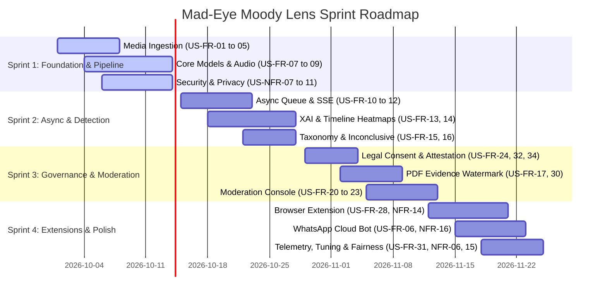

# Mad-Eye Moody Lens: Deepfake Detection Platform
## Comprehensive Agile Requirements Specification: User Stories & Acceptance Criteria
**Document Version:** 1.0.0  
**Project:** DA-IICT IT314 Software Engineering Course Project  
**Repository:** [Mad-Eye-Moody-Lens](https://github.com/Tanish-30-08-2006/Mad-Eye-Moody-Lens)  
**Standard:** Google Engineering Requirements & Agile User Story Framework  
**Traceability:** Mapped directly to Task 3 Requirements (FR-1 to FR-34, NFR-1 to NFR-25, DR-1 to DR-17)

---

## 1. Stakeholder & Persona Taxonomy

To ensure user stories are rooted in authentic user needs and operational contexts, the system defines six distinct primary and secondary personas derived from the Task 2 elicitation interviews and technical analyses:

| Persona Name | Role / Title | Primary Goals & Context |
|---|---|---|
| **Sarah (The Fact-Checker)** | Investigative Journalist / Newsroom Fact-Checker | Needs rapid verification (<60s triage) during breaking news, interpretable forensic visual heatmaps, frame-by-frame scrutiny, and certified PDF evidence reports to protect editorial integrity. |
| **Alex (The Trust & Safety Lead)** | Social Media Platform Moderator | Manages high-throughput queues, needs inline one-click moderation actions (demote, label, remove), false-positive reduction on compressed UGC, and audit-logged manual override workflows. |
| **Priya (The Everyday Citizen)** | General Public / WhatsApp & Social Media Consumer | Receives suspicious viral forwards on messaging apps; requires frictionless browser/WhatsApp verification, simple non-jargon explanations, and strict privacy assurances. |
| **Dr. Chen (The ML Detection Engineer)** | Applied AI / Computer Vision Specialist | Focuses on multi-modal model inference (RetinaFace, Xception, ASVspoof LFCC/CQCC), threshold calibration (FAR vs. FRR), demographic fairness, and modular zero-downtime hot-swapping. |
| **Marcus (The Infrastructure / SRE Lead)** | Full-Stack & Cloud Systems Architect | Enforces async event-driven task distribution, AWS S3 pre-signed uploads, zero-trust ephemeral storage lifecycle (24h deletion), OWASP security, and burst traffic autoscaling. |
| **Advocate Mehta (The Compliance & Legal Officer)** | Privacy, Regulatory & Ethics Counsel | Guarantees compliance with India's DPDPA 2023, EU AI Act, GDPR Art. 9/17/22, BNS 2023 defamation safeguards, CC BY 4.0 licensing, and mandatory academic liability watermarks. |

---

## 2. Functional User Stories (FR-1 through FR-34)

### Epic 1: Secure Media Ingestion & Multi-Channel Upload (FR-1 to FR-6)

#### US-FR-01: Multimodal File Ingestion via Web Interface
- **Traceability:** FR-1 | **Priority:** P0 (Must Have) | **Story Points:** 3
- **User Story:**
  > **As a** Fact-Checker or Everyday User,  
  > **I want to** select and upload image, video, and audio files directly through a web interface restricted to supported media types,  
  > **So that** I do not accidentally submit unsupported file formats that waste processing time or cause system failures.
- **Acceptance Criteria:**
  - **Given** the user is on the media upload interface,
  - **When** the user clicks the upload trigger or opens the native file picker,
  - **Then** the file picker dialog must restrict selectable extensions via the HTML `accept="image/*,video/*,audio/*"` attribute.
  - **And** drag-and-drop zones must reject unaccepted MIME types immediately with visual feedback before transfer.

#### US-FR-02: Client-Side Pre-Flight File Validation
- **Traceability:** FR-2 | **Priority:** P0 (Must Have) | **Story Points:** 2
- **User Story:**
  > **As an** Everyday User on a constrained internet connection,  
  > **I want** the browser to validate my file size and MIME type before uploading (≤10MB for images, ≤100MB for video),  
  > **So that** I get instantaneous feedback and avoid waiting for large, invalid uploads to fail on the server.
- **Acceptance Criteria:**
  - **Given** an image file exceeding 10MB or a video exceeding 100MB,
  - **When** the user selects the file in the browser,
  - **Then** the client application immediately halts the upload pipeline,
  - **And** displays an accessible error toast: `"File exceeds maximum allowed limit (Images: 10MB, Videos: 100MB). Please compress or trim your file."`
  - **And** the upload state resets without consuming backend network bandwidth.

#### US-FR-03: Server-Side Cryptographic Magic-Number Validation
- **Traceability:** FR-3 (OWASP) | **Priority:** P0 (Must Have) | **Story Points:** 5
- **User Story:**
  > **As an** Infrastructure Engineer (Marcus),  
  > **I want** the backend ingestion service to inspect the binary signature ("magic numbers") of all incoming files regardless of file extension or client header,  
  > **So that** malicious actors cannot execute Remote Code Execution (RCE) or file-inclusion attacks by disguising executables as images.
- **Acceptance Criteria:**
  - **Given** an uploaded file named `payload.jpg` containing an ELF or executable script header,
  - **When** the ingestion service receives the file buffer,
  - **Then** it reads the leading binary bytes (e.g., `FF D8 FF` for JPEG, `89 50 4E 47` for PNG, `ftyp` for MP4),
  - **And** rejects mismatched headers with HTTP 415 (Unsupported Media Type),
  - **And** logs a security warning with client IP and file hash without passing the payload to the ML pipeline.

#### US-FR-04: UUIDv4 Sanitization and Isolated Storage Execution Prevention
- **Traceability:** FR-4 (OWASP) | **Priority:** P0 (Must Have) | **Story Points:** 3
- **User Story:**
  > **As an** Infrastructure Engineer (Marcus),  
  > **I want** the system to strip original file names, assign a cryptographic UUIDv4 identifier, and store payloads in non-executable storage,  
  > **So that** directory traversal attacks, script execution, and user tracking through metadata filenames are prevented.
- **Acceptance Criteria:**
  - **Given** a successfully validated uploaded file `investigation_source_raw.mp4`,
  - **When** the file is stored in temporary staging storage,
  - **Then** the file is renamed to `<uuidv4>.mp4` (e.g., `4a1b8c9d-5e2f-4a3b-9c8d-1e2f3a4b5c6d.mp4`),
  - **And** placed in a storage partition mounted with `noexec` flags and private ACLs.

#### US-FR-05: Direct-to-Cloud Pre-Signed Object Storage Ingestion
- **Traceability:** FR-5 | **Priority:** P0 (Must Have) | **Story Points:** 5
- **User Story:**
  > **As a** Full-Stack Developer,  
  > **I want** the frontend to request a pre-signed, short-lived upload URL (S3/GCS) from the API server and upload large video/audio directly to object storage,  
  > **So that** application server memory and thread pools are not saturated by handling large file streams.
- **Acceptance Criteria:**
  - **Given** an authenticated or validated guest session uploading a 70MB video,
  - **When** the user initiates the upload,
  - **Then** the frontend calls `POST /api/v1/media/presign-upload` and receives a pre-signed S3 URL valid for 15 minutes,
  - **And** the client streams the payload directly to AWS S3 using `PUT`,
  - **And** notifies the backend upon upload completion via an SQS/webhook trigger to launch the inference task.

#### US-FR-06: WhatsApp "Forward-to-Verify" Cloud Ingestion Gateway
- **Traceability:** FR-6 | **Priority:** P1 (Should Have) | **Story Points:** 8
- **User Story:**
  > **As an** Everyday Citizen (Priya),  
  > **I want to** forward a suspicious video or audio clip to the official Mad-Eye Moody WhatsApp Business Bot,  
  > **So that** I can verify viral media without installing a dedicated application or opening a desktop browser.
- **Acceptance Criteria:**
  - **Given** a user forwards media to the official WhatsApp Business Cloud API webhook,
  - **When** the webhook payload containing the temporary media URL is received,
  - **Then** the ingestion worker downloads the binary payload within 3 minutes (well before the 5-minute Meta URL expiration),
  - **And** enqueues the media into the standard asynchronous inference pipeline,
  - **And** strictly operates in forward-only mode without inspecting any private user-to-user chat histories.

---

### Epic 2: Multi-Modal AI Detection & Async Processing Engine (FR-7 to FR-12, FR-29, FR-31)

#### US-FR-07: Specialized Multi-Modal Model Routing
- **Traceability:** FR-7 | **Priority:** P0 (Must Have) | **Story Points:** 5
- **User Story:**
  > **As an** ML Detection Engineer (Dr. Chen),  
  > **I want** the preprocessing dispatcher to inspect the media modality and route payloads to specialized detection architectures (CNN for facial images/videos, spectrogram-based classifier for audio),  
  > **So that** each modality is evaluated with maximum domain-specific feature extraction rather than an unsuitable generalist model.
- **Acceptance Criteria:**
  - **Given** an incoming media verification job,
  - **When** the file is an image or video,
  - **Then** the dispatcher invokes the face-manipulation CNN pipeline (e.g., Xception/EfficientNet),
  - **When** the file is an audio stream,
  - **Then** the dispatcher invokes the acoustic spectral classifier (ASVspoof LFCC/CQCC model),
  - **And** for audiovisual videos, both pipelines execute concurrently and feed into cross-modal reconciliation.

#### US-FR-08: Facial Landmark Detection & 1.3× Dynamic Bounding Box Cropping
- **Traceability:** FR-8 | **Priority:** P0 (Must Have) | **Story Points:** 5
- **User Story:**
  > **As an** ML Detection Engineer (Dr. Chen),  
  > **I want** the visual inference pipeline to detect faces (via RetinaFace/MTCNN), expand bounding boxes by 1.3× to capture blending boundaries, and normalize dimensions,  
  > **So that** subtle surgical deepfake artifacts along jawlines and hair boundaries are preserved for the classifier.
- **Acceptance Criteria:**
  - **Given** an uploaded portrait or video frame containing a human subject,
  - **When** the visual preprocessing pipeline executes,
  - **Then** the face detector locates all face regions with a confidence threshold ≥0.90,
  - **And** expands the detected coordinates uniformly by 1.3×,
  - **And** crops and resizes the region to the standard model input tensor (e.g., 299×299 for Xception),
  - **And** if no face is detected, marks the task for heuristic artifact analysis or inconclusive fallback.

#### US-FR-09: Audio Transcoding and LFCC/CQCC Spectral Feature Extraction
- **Traceability:** FR-9 | **Priority:** P0 (Must Have) | **Story Points:** 5
- **User Story:**
  > **As an** ML Detection Engineer (Dr. Chen),  
  > **I want** incoming audio files to be automatically transcoded to 16kHz 16-bit mono WAV and converted to LFCC/CQCC spectrograms,  
  > **So that** synthetic voice clones and vocoder artifacts are detected under standardized acoustic conditions.
- **Acceptance Criteria:**
  - **Given** an arbitrary uploaded audio clip (e.g., AAC, MP3, OGG, FLAC),
  - **When** the audio pipeline ingests the stream,
  - **Then** FFmpeg standardizes the stream to PCM 16kHz, 16-bit, single-channel WAV,
  - **And** computes Linear Frequency Cepstral Coefficients (LFCC) and Constant Q Cepstral Coefficients (CQCC),
  - **And** passes the structured feature matrix to the acoustic classification model.

#### US-FR-10: Asynchronous Task Ticket Issuance & Non-Blocking Polling
- **Traceability:** FR-10 | **Priority:** P0 (Must Have) | **Story Points:** 5
- **User Story:**
  > **As a** Fact-Checker (Sarah),  
  > **I want** the system to immediately return a unique Task ID and "processing" status upon uploading heavy video/audio,  
  > **So that** my browser connection does not hang or timeout while intensive deep-learning inference runs.
- **Acceptance Criteria:**
  - **Given** a user submits a 60-second video for deep forensic evaluation,
  - **When** the backend receives the upload confirmation,
  - **Then** it enqueues the job into Celery/Redis within 500ms,
  - **And** responds with HTTP 202 (Accepted) returning JSON payload `{"task_id": "job_98432b", "status": "PENDING", "estimated_duration_sec": 45}`,
  - **And** releases the HTTP connection without blocking.

#### US-FR-11: Real-Time SSE/WebSocket Inference Progress Telemetry
- **Traceability:** FR-11 | **Priority:** P1 (Should Have) | **Story Points:** 5
- **User Story:**
  > **As a** Fact-Checker or Moderator,  
  > **I want to** see live progress steps ("Uploading", "Extracting Frames", "Scanning Audio", "Synthesizing Heatmap", "Complete") in the UI,  
  > **So that** I have full visibility into the processing lifecycle and know the system has not stalled.
- **Acceptance Criteria:**
  - **Given** an active background inference job,
  - **When** the client subscribes to the Server-Sent Events (SSE) endpoint `/api/v1/tasks/{id}/progress`,
  - **Then** the backend pushes discrete status events as pipeline stages complete,
  - **And** the UI progress bar advances accurately from 0% to 100% with human-readable milestone indicators.

#### US-FR-12: Dual-Tier Rapid Triage vs. Deep Forensic Scan
- **Traceability:** FR-12 | **Priority:** P0 (Must Have) | **Story Points:** 5
- **User Story:**
  > **As a** Fact-Checker under deadline pressure,  
  > **I want** the option to run an express "Triage Scan" (sub-60 seconds) or an optional "Deep Forensic Scan",  
  > **So that** I can make split-second publish/hold decisions during breaking news while retaining the ability to run exhaustive analysis later.
- **Acceptance Criteria:**
  - **Given** a user submitting video media,
  - **When** the user selects "Rapid Triage",
  - **Then** the pipeline samples 1 frame per second, evaluates the top 5 keyframes, and returns a preliminary verdict in <30 seconds,
  - **When** the user selects "Deep Forensic Scan",
  - **Then** the pipeline evaluates all extracted face tracks, runs audio-visual lip-sync synchronization, and completes within 2–5 minutes.

#### US-FR-29: Transparent Frame-Level Aggregation & Method Disclosure
- **Traceability:** FR-29 | **Priority:** P0 (Must Have) | **Story Points:** 3
- **User Story:**
  > **As an** Investigative Journalist (Sarah),  
  > **I want** video-level verdicts to be mathematically aggregated from individual frame predictions and the aggregation method disclosed in the explanation,  
  > **So that** I understand whether a video was flagged due to an isolated single-frame artifact or sustained multi-frame manipulation.
- **Acceptance Criteria:**
  - **Given** a processed video of 150 sampled frames,
  - **When** frame-level probabilities are consolidated into the final video verdict,
  - **Then** the system applies an explicit, documented aggregation algorithm (e.g., 75th-percentile probability pooling or weighted majority vote),
  - **And** the XAI report discloses: `"Video verdict aggregated via 75th-percentile pooling across 150 sampled frames (38 frames flagged with >85% manipulation confidence)." `

#### US-FR-31: Admin Decision-Threshold Calibration Interface
- **Traceability:** FR-31 | **Priority:** P1 (Should Have) | **Story Points:** 5
- **User Story:**
  > **As an** ML Engineer (Dr. Chen),  
  > **I want** an authenticated, role-based admin dashboard to inspect ROC curves and calibrate classifier log-likelihood decision thresholds (LLR/probability cutoffs),  
  > **So that** the team can tune the balance between False Alarm Rate (FAR) and Missed Detection Rate (FRR) as synthetic techniques evolve.
- **Acceptance Criteria:**
  - **Given** an authenticated user with `ROLE_ML_ADMIN`,
  - **When** the admin navigates to `/admin/threshold-calibration`,
  - **Then** the interface displays validation confusion matrices, ROC/AUC metrics, and slider controls for classification boundaries,
  - **And** threshold adjustments take effect dynamically across worker nodes without requiring service redeployment.

---

### Epic 3: Explainable AI (XAI), Visual Evidence & Reporting (FR-13 to FR-17, FR-30)

#### US-FR-13: Probabilistic Score & Plain-Language Contributing Factor Narrative
- **Traceability:** FR-13 (EU AI Act) | **Priority:** P0 (Must Have) | **Story Points:** 5
- **User Story:**
  > **As a** Fact-Checker or Moderator,  
  > **I want** every detection output to display a calibrated confidence percentage paired with a plain-language explanation of detected anomalies,  
  > **So that** I never receive an ambiguous bare binary ("Real/Fake") label and can defend my editorial judgment to the public.
- **Acceptance Criteria:**
  - **Given** a completed detection run,
  - **When** the results screen loads,
  - **Then** the system renders a probabilistic confidence bar (e.g., `"87% Likelihood of Synthetic Generation"`),
  - **And** explicitly provides contextual reasoning bullet points (e.g., `"Frequency domain analysis reveals unnatural high-frequency blending around facial perimeter; audio pitch spectrum indicates neural vocoder synthesis"`),
  - **And** strictly forbids rendering absolute unconditional binary labels.

#### US-FR-14: Interactive Spatial Bounding Box & Video Timeline Heatmaps
- **Traceability:** FR-14 | **Priority:** P0 (Must Have) | **Story Points:** 8
- **User Story:**
  > **As a** Fact-Checker (Sarah),  
  > **I want** suspicious image regions highlighted with bounding boxes/heatmaps and videos annotated with an interactive temporal heatmap scrubber,  
  > **So that** I can jump directly to the exact seconds or pixels where synthetic manipulation occurred.
- **Acceptance Criteria:**
  - **Given** an image or video with detected facial anomalies,
  - **When** viewing the forensic results in the web dashboard,
  - **Then** images render Grad-CAM saliency heatmaps highlighting unnatural pixel gradients,
  - **And** videos display a timeline bar color-coded by frame suspicion (Green = Low, Amber = Medium, Red = High anomaly score),
  - **And** clicking a red segment on the timeline seeks the video player directly to that timestamp.

#### US-FR-15: Granular Manipulation Taxonomy Classification
- **Traceability:** FR-15 | **Priority:** P1 (Should Have) | **Story Points:** 5
- **User Story:**
  > **As a** Social Media Moderator (Alex),  
  > **I want** the system to classify the specific modality of tampering (e.g., Face-Swap, Lip-Sync Re-enactment, Text-to-Speech Voice Clone, Metadata Erasure),  
  > **So that** I can assign the appropriate platform moderation tag and enforcement policy.
- **Acceptance Criteria:**
  - **Given** an AI-generated or manipulated media file,
  - **When** the analysis completes with confidence above the decision threshold,
  - **Then** the result badge displays the identified subtype: `[Face Swap]`, `[Voice Clone]`, `[Expression Re-enactment]`, or `[Complete Synthetic Generation]`,
  - **And** specifies whether the anomaly was detected in visual tracks, audio tracks, or both.

#### US-FR-16: Explicit "Inconclusive" Diagnostic State Fallback
- **Traceability:** FR-16 | **Priority:** P0 (Must Have) | **Story Points:** 3
- **User Story:**
  > **As an** Everyday User or Fact-Checker,  
  > **I want** the system to return an explicit "Inconclusive" verdict with diagnostic reasons when media is too low-quality or ambiguous,  
  > **So that** I am not misled by a false positive or unwarranted false negative on degraded media.
- **Acceptance Criteria:**
  - **Given** an uploaded video with heavy WhatsApp compression (e.g., resolution <360p, high blockiness artifacts, or extreme motion blur),
  - **When** model confidence falls within the ambiguous band (e.g., 40%–60%),
  - **Then** the primary verdict displays as `Inconclusive / Insufficient Evidence`,
  - **And** explains the root cause: `"Analysis inconclusive due to extreme compression artifacts and insufficient facial landmark resolution. High risk of false positive if forced."`

#### US-FR-17: Exportable Plain-Language Evidence Report with Academic Disclaimer Watermark
- **Traceability:** FR-17, DR-8 | **Priority:** P0 (Must Have) | **Story Points:** 5
- **User Story:**
  > **As a** Journalist (Sarah),  
  > **I want to** download a publication-ready PDF Evidence Report containing visual heatmaps, timestamps, metadata, and an explicit academic disclaimer watermark,  
  > **So that** I can attach it to my editorial verification package while preventing misuse as uncertified legal proof under BNS 2023.
- **Acceptance Criteria:**
  - **Given** any completed verification result,
  - **When** the user clicks "Download Verification Report (PDF)",
  - **Then** the system compiles a standardized PDF report containing media hash (SHA-256), ingest timestamp, confidence scores, visual heatmap crops, and analyst notes,
  - **And** embeds a prominent, unremovable diagonal header/watermark: `"UNCERTIFIED ACADEMIC AI ANALYSIS — NOT VALID AS STANDALONE LEGAL EVIDENCE (Section 63 BNS 2023)"`.

#### US-FR-30: Automated Keyframe & Container Metadata Inspection
- **Traceability:** FR-30 | **Priority:** P1 (Should Have) | **Story Points:** 5
- **User Story:**
  > **As an** Investigative Journalist (Sarah),  
  > **I want** the system to automatically extract representative keyframes and display raw container/EXIF metadata (creation software, device, GPS tags, quantization tables),  
  > **So that** I can conduct manual forensic verification alongside the automated neural network predictions.
- **Acceptance Criteria:**
  - **Given** an uploaded image or video,
  - **When** forensic inspection loads,
  - **Then** the UI displays an EXIF/Metadata accordion showing camera model, software tags (e.g., Adobe Photoshop, Stable Diffusion headers), and audio codecs,
  - **And** renders an interactive gallery of top 10 I-frame keyframes extracted during video decoding.

---

### Epic 4: Collaborative Verification & Secure Sharing (FR-18, FR-19)

#### US-FR-18: Access-Controlled Ephemeral Verification Link Generation
- **Traceability:** FR-18, NFR-10 | **Priority:** P1 (Should Have) | **Story Points:** 3
- **User Story:**
  > **As a** Journalist (Sarah),  
  > **I want to** generate a password-protected or time-expiring verification link to share with fellow editors,  
  > **So that** trusted team members can review the forensic evidence without exposing the report to search engine indexing or the public internet.
- **Acceptance Criteria:**
  - **Given** a completed analysis,
  - **When** the user clicks "Share Verification Link",
  - **Then** the system prompts for optional password and expiration TTL (e.g., 2 hours, 24 hours, 7 days),
  - **And** generates a cryptographically random tokenized URL (e.g., `/verify/share/7f9a2b4...`),
  - **And** includes HTTP response headers `X-Robots-Tag: noindex, nofollow` to prevent crawler indexing.

#### US-FR-19: One-Click WhatsApp "Click-to-Chat" Verification Sharing
- **Traceability:** FR-19 | **Priority:** P2 (Could Have) | **Story Points:** 2
- **User Story:**
  > **As an** Everyday Citizen (Priya),  
  > **I want** a pre-filled "Share to WhatsApp" (`wa.me`) button containing the summary verdict and evidence link,  
  > **So that** I can easily send the fact-check back into the WhatsApp group where the fake video was originally circulated.
- **Acceptance Criteria:**
  - **Given** a completed verification report,
  - **When** the user taps "Share via WhatsApp",
  - **Then** the application invokes a standard `https://wa.me/?text=...` URI intent,
  - **And** pre-fills the message text: `"⚠️ Deepfake Verification Alert: The video circulating regarding [Subject] shows 88% likelihood of AI manipulation. Full forensic summary: [Short-URL]"`.

---

### Epic 5: Enterprise Moderation Queue & Workflow Integration (FR-20 to FR-23)

#### US-FR-20: Integrated Moderation Triage Console with Action Triggers
- **Traceability:** FR-20 | **Priority:** P0 (Must Have) | **Story Points:** 5
- **User Story:**
  > **As a** Social Media Moderator (Alex),  
  > **I want** the detection tool embedded in my moderation queue with quick-action buttons (`[Label as Manipulated]`, `[Demote Distribution]`, `[Takedown]`, `[Escalate]`),  
  > **So that** I can execute enforcement decisions in seconds without switching browser tabs.
- **Acceptance Criteria:**
  - **Given** a reported post in the moderation inbox,
  - **When** the moderator views the item,
  - **Then** the deepfake detection verdict, confidence score, and primary heatmap display directly in the panel,
  - **And** clicking an action button dispatches an authenticated audit event to the platform moderation engine to enact the selected enforcement.

#### US-FR-21: Human-in-the-Loop Feedback & Active Learning Flagging
- **Traceability:** FR-21 | **Priority:** P1 (Should Have) | **Story Points:** 3
- **User Story:**
  > **As a** Moderator or Journalist,  
  > **I want to** mark an automated result as "Agree" or "Disagree" with an optional comment,  
  > **So that** false positives and false negatives are logged for engineering review and model retraining.
- **Acceptance Criteria:**
  - **Given** a finished detection result,
  - **When** the user clicks "Provide Feedback (Thumbs Up / Thumbs Down)",
  - **Then** the system captures the model version, task ID, user rating, and optional error classification (e.g., "False positive due to stage lighting"),
  - **And** persists the anonymized feedback record into a dedicated review queue for ML engineers.

#### US-FR-22: Ambiguity Routing to Manual Dispute & Documented Override Queue
- **Traceability:** FR-22 | **Priority:** P1 (Should Have) | **Story Points:** 5
- **User Story:**
  > **As a** Trust & Safety Lead (Alex),  
  > **I want** low-confidence or borderline results to automatically route to a senior human review queue and require documented reasoning to override,  
  > **So that** automated AI does not unilaterally censor legitimate speech without accountable human oversight.
- **Acceptance Criteria:**
  - **Given** an automated inference result scoring between 45% and 65% confidence,
  - **When** the job completes,
  - **Then** the post is flagged as `NEEDS_SENIOR_REVIEW` and enqueued in the dispute dashboard,
  - **And** a moderator can only override the system recommendation after selecting a mandatory justification code and entering an audit comment.

#### US-FR-23: Automated Reverse-Image & Contextual Provenance Assistance
- **Traceability:** FR-23 | **Priority:** P1 (Should Have) | **Story Points:** 5
- **User Story:**
  > **As a** Fact-Checker or Moderator,  
  > **I want** the system to execute automated reverse-image and provenance searches on extracted keyframes,  
  > **So that** I can immediately identify "cheapfakes" (real, unmanipulated historical footage shared in a misleading, out-of-context modern scenario).
- **Acceptance Criteria:**
  - **Given** an uploaded suspect image or video keyframe,
  - **When** the user clicks "Check Historical Provenance",
  - **Then** the system queries reverse-search APIs (e.g., Google Vision Web Search / TinEye) with the media fingerprint,
  - **And** returns matching web URLs, original earliest publication dates, and historical captions in a side-by-side comparison card.

---

### Epic 6: Trust, Governance, Legal Compliance & Privacy (FR-24 to FR-27, FR-32 to FR-34)

#### US-FR-24 & US-FR-32: Multilingual Pre-Upload Informed Consent Modal
- **Traceability:** FR-24, FR-32 (DPDPA Section 5) | **Priority:** P0 (Must Have) | **Story Points:** 3
- **User Story:**
  > **As a** Diverse Indian or Global Citizen,  
  > **I want to** view a clear, plain-language affirmative consent notice in English or Hindi before uploading any media,  
  > **So that** I understand exactly what personal biometric signals are extracted and how my data is protected under DPDPA 2023.
- **Acceptance Criteria:**
  - **Given** a user opens the upload modal for the first time,
  - **When** the upload dialogue initializes,
  - **Then** it blocks file submission until the user affirmatively clicks "I Consent",
  - **And** provides an accessible language toggle switching dynamically between English and Hindi,
  - **And** clearly enumerates data collected, zero permanent retention, and absence of commercial monetization.

#### US-FR-25: Prominent Probabilistic & Non-Legal Determination Disclaimer
- **Traceability:** FR-25 (EU AI Act, GDPR Art. 22) | **Priority:** P0 (Must Have) | **Story Points:** 2
- **User Story:**
  > **As a** Compliance Officer (Advocate Mehta),  
  > **I want** a permanent disclaimer displayed on all results screens stating that verdicts are probabilistic AI estimations and do not constitute definitive legal facts,  
  > **So that** the application avoids defamation liability and complies with algorithmic accountability regulations.
- **Acceptance Criteria:**
  - **Given** any screen or view displaying a verification score,
  - **When** rendered to the user,
  - **Then** a fixed badge states: `"Disclaimer: Automated AI analysis provides probabilistic likelihood indicators based on technical artifacts. It does not constitute verified legal proof or judicial evidence."`

#### US-FR-26: Non-Technical Error Handling & Self-Service Upload Reset
- **Traceability:** FR-26 | **Priority:** P1 (Should Have) | **Story Points:** 3
- **User Story:**
  > **As an** Everyday User,  
  > **I want** system errors (e.g., corrupt files, network drops, server timeouts) presented in friendly, actionable language with an instant reset button,  
  > **So that** I understand what went wrong without seeing cryptic HTTP 500 codes and can easily retry my upload.
- **Acceptance Criteria:**
  - **Given** a backend network disruption or unparseable audio file,
  - **When** the server returns an error response,
  - **Then** the UI intercepts the raw error and displays a clear message (e.g., `"Unable to read audio format. Please ensure your audio file is uncorrupted and try again."`),
  - **And** provides a primary `"Try Again"` button that resets the upload file input cleanly.

#### US-FR-27: Academic Dataset Attribution & Open-Source Credits
- **Traceability:** FR-27, DR-4 (ASVspoof CC BY 4.0) | **Priority:** P1 (Should Have) | **Story Points:** 1
- **User Story:**
  > **As a** Dataset Provider / Academic Researcher,  
  > **I want** the application to display explicit attribution for research datasets (FaceForensics++, ASVspoof 2019 CC BY 4.0) on an "About/Credits" page,  
  > **So that** academic intellectual property and licensing covenants are fully honored.
- **Acceptance Criteria:**
  - **Given** any visitor navigating to `/about` or `/credits`,
  - **When** the page renders,
  - **Then** it presents standard academic citations and licensing notices for FaceForensics++, ASVspoof 2019, and RetinaFace,
  - **And** includes an explicit hyperlink to the respective licensing terms.

#### US-FR-33: User Consent Revocation & Grievance Redressal Gateway
- **Traceability:** FR-33 (DPDPA Section 5 & 13) | **Priority:** P1 (Should Have) | **Story Points:** 3
- **User Story:**
  > **As an** Everyday User,  
  > **I want** a dedicated web form to submit data erasure requests or file a grievance with the platform's Data Protection Officer,  
  > **So that** I can exercise my statutory rights under Section 13 of the Digital Personal Data Protection Act (DPDPA).
- **Acceptance Criteria:**
  - **Given** a user navigating to the footer link `"Privacy & Grievances"`,
  - **When** the user submits their verification task ID or email with a grievance description,
  - **Then** the system logs a cryptographically timestamped ticket,
  - **And** purges any cached server logs associated with that task ID within 24 hours,
  - **And** issues an automated confirmation receipt with an escalation tracking number.

#### US-FR-34: Mandatory Anti-NCII & Individual Rights Attestation Checkbox
- **Traceability:** FR-34, DR-11 (IT Rules 2021, BNS 2023) | **Priority:** P0 (Must Have) | **Story Points:** 2
- **User Story:**
  > **As a** Compliance Officer (Advocate Mehta),  
  > **I want** every user to affirmatively check a binding Terms of Service declaration confirming they hold appropriate rights and that media does not contain Non-Consensual Intimate Imagery (NCII),  
  > **So that** the platform actively deters revenge porn submissions and insulates itself against criminal hosting liability.
- **Acceptance Criteria:**
  - **Given** the pre-upload consent modal,
  - **When** preparing to submit media,
  - **Then** the "Analyze Media" button remains disabled until the user checks: `"I certify that I have the legal right or consent to analyze this media, and that this content does not depict non-consensual sexual content, minors, or unlawful harassment."`

---

### Epic 7: Real-Time Web Browser Extension (FR-28)

#### US-FR-28: In-Situ Social Media DOM Element Scanning & Inline Verification
- **Traceability:** FR-28, NFR-23 | **Priority:** P1 (Should Have) | **Story Points:** 8
- **User Story:**
  > **As an** Everyday Consumer (Priya) or Fact-Checker (Sarah),  
  > **I want** the Mad-Eye Moody Chrome Extension to detect ``, `<video>`, and `<audio>` elements on social feeds (e.g., X/Twitter, Reddit) and inject an overlay "Verify" button,  
  > **So that** I can verify viral media instantly in my feed without downloading files or leaving the webpage.
- **Acceptance Criteria:**
  - **Given** a user browses a supported social media platform with the extension active,
  - **When** media elements enter the browser viewport,
  - **Then** the content script injects a subtle `"Verify Authenticity"` badge on hover,
  - **When** the user clicks the badge,
  - **Then** the Manifest V3 background service worker extracts the media source URL, calls the backend verification endpoint, and displays the probabilistic result and heatmap directly in an inline flyout modal.

---

## 3. Non-Functional & System User Stories (NFR-1 to NFR-25)

In accordance with enterprise agile software engineering practices, non-functional requirements are formalized as architectural, security, and quality user stories to ensure direct testability in CI/CD pipelines.

### Epic 8: Performance, Latency & Autoscaling Infrastructure (NFR-1, NFR-2, NFR-3, NFR-21, NFR-22)

#### US-NFR-01: Low-Latency Inference SLAs & Asynchronous Job Throttling
- **Traceability:** NFR-1, NFR-2 | **Priority:** P0 | **Story Points:** 5
- **User Story:**
  > **As an** Infrastructure Architect (Marcus),  
  > **I want** image triage jobs to resolve within 15 seconds (p95) and video triage in under 60 seconds via an event-driven worker queue,  
  > **So that** user sessions never breach gateway timeouts (60s) and system responsiveness meets fast-paced journalistic demands.
- **Acceptance Criteria:**
  - **Given** a burst of 50 concurrent image upload requests,
  - **When** processed by the Celery/Redis GPU worker pool,
  - **Then** 95% of image classification jobs return a complete verdict payload in <15 seconds,
  - **And** any inference job exceeding 30 seconds automatically yields heartbeat signals to prevent socket disconnects.

#### US-NFR-02: GPU Acceleration with Dynamic CPU Cost-Tier Fallback
- **Traceability:** NFR-3, NFR-22 | **Priority:** P1 | **Story Points:** 5
- **User Story:**
  > **As a** DevOps / SRE Lead,  
  > **I want** the inference runtime to execute on NVIDIA TensorRT / CUDA-accelerated GPU instances with an automated fallback to quantized ONNX-CPU containers,  
  > **So that** the development and staging environments can operate cost-effectively within academic budget constraints while production leverages hardware acceleration.
- **Acceptance Criteria:**
  - **Given** a deployment on a CPU-only staging instance,
  - **When** model weights initialize,
  - **Then** the runtime detects the absence of CUDA, loads INT8-quantized ONNX models, and completes single-image inference in <5 seconds without crashing.

#### US-NFR-03: Elastic Autoscaling on Viral Traffic Surges
- **Traceability:** NFR-21, NFR-25 | **Priority:** P1 | **Story Points:** 5
- **User Story:**
  > **As an** SRE Lead (Marcus),  
  > **I want** cloud worker clusters to automatically scale out when the task queue depth exceeds 20 jobs,  
  > **So that** the platform remains fully available during breaking-news viral deepfake events without dropping user uploads.
- **Acceptance Criteria:**
  - **Given** a sudden surge in verification traffic during an election or breaking crisis,
  - **When** Redis queue depth exceeds 20 pending tasks for >60 seconds,
  - **Then** the Kubernetes HPA / Cloud Autoscaler provisions additional worker pods up to the defined budget ceiling,
  - **And** average queue wait time does not exceed 45 seconds.

---

### Epic 9: Model Robustness, Degradation & Zero-Downtime Governance (NFR-4, NFR-5, NFR-6, DR-17)

#### US-NFR-04: Compression-Resilient Robustness & Fallback Boundaries
- **Traceability:** NFR-4, NFR-5 | **Priority:** P0 | **Story Points:** 8
- **User Story:**
  > **As an** ML Engineer (Dr. Chen),  
  > **I want** detection models to be evaluated against multi-compression validation sets (JPEG quality factor 40–80, H.264 CRF 28–35),  
  > **So that** accuracy does not catastrophically collapse on real-world compressed WhatsApp/social media media.
- **Acceptance Criteria:**
  - **Given** media compressed to social-media bitrates (e.g., FaceForensics++ c40 compression level),
  - **When** passed through model evaluation,
  - **Then** validation AUC must exceed 0.82,
  - **And** for media where high-frequency degradation prevents reliable feature extraction, the system gracefully triggers the "Inconclusive" state rather than hallucinating an overconfident verdict.

#### US-NFR-05: Dynamic Zero-Downtime Model Hot-Swapping
- **Traceability:** NFR-6 | **Priority:** P1 | **Story Points:** 5
- **User Story:**
  > **As an** ML Engineer (Dr. Chen),  
  > **I want** the inference microservice to reload updated model weights via blue/green worker deployment without restarting the web gateway,  
  > **So that** new deepfake architecture countermeasures can be deployed continuously with zero downtime for users.
- **Acceptance Criteria:**
  - **Given** a newly trained EfficientNet weight checkpoint,
  - **When** deployed to production,
  - **Then** worker nodes gracefully drain active jobs, load the new weights into GPU VRAM, and register as healthy,
  - **And** ongoing user upload sessions experience zero dropped requests or HTTP 502 errors.

#### US-NFR-06: Demographic Parity & Algorithmic Fairness Auditing
- **Traceability:** DR-17 | **Priority:** P1 | **Story Points:** 5
- **User Story:**
  > **As an** AI Ethics & Compliance Officer (Advocate Mehta),  
  > **I want** model releases to pass automated fairness evaluation across diverse demographic subgroups (skin tone, gender, age cohorts using DFDC subsets),  
  > **So that** the false-positive rate does not disproportionately harm or misclassify historically underrepresented groups.
- **Acceptance Criteria:**
  - **Given** a candidate model artifact in the CI/CD pipeline,
  - **When** the automated bias benchmark executes,
  - **Then** the difference in False Positive Rate (FPR) across Fitzpatrick skin type groups 1–6 must remain within a ±5% variance margin,
  - **And** models breaching the fairness disparity threshold are automatically blocked from production promotion.

---

### Epic 10: Zero-Trust Security, Data Minimization & Ephemeral Storage (NFR-7 to NFR-14, DR-5, DR-12, DR-13)

#### US-NFR-07: End-to-End Cryptographic Encryption in Transit and at Rest
- **Traceability:** NFR-7 | **Priority:** P0 | **Story Points:** 3
- **User Story:**
  > **As an** Information Security Engineer,  
  > **I want** all user communications enforced over TLS 1.3 and temporary storage partitions encrypted using AES-256 with KMS keys,  
  > **So that** user media cannot be intercepted over public networks or accessed via raw storage volume snapshots.
- **Acceptance Criteria:**
  - **Given** any inbound connection to the platform,
  - **When** HTTP/1.1 or plaintext attempts occur,
  - **Then** the gateway immediately issues an HTTP 301 redirect to HTTPS with strict HSTS headers (`max-age=31536000; includeSubDomains`),
  - **And** S3 buckets and EBS storage volumes enforce server-side AES-256 encryption by default.

#### US-NFR-08: Zero-Trust Ephemeral Media Lifecycle & 24-Hour Automated Shredding
- **Traceability:** NFR-11, DR-13 | **Priority:** P0 | **Story Points:** 3
- **User Story:**
  > **As a** Privacy Officer and Everyday User,  
  > **I want** uploaded media files deleted immediately upon completion of inference, with a hard 24-hour cloud lifecycle deletion policy as a fail-safe,  
  > **So that** sensitive personal media is never indefinitely stored or vulnerable to historical data breaches.
- **Acceptance Criteria:**
  - **Given** an inference job terminates (either in success or failure),
  - **When** the final verdict payload is serialized,
  - **Then** the worker issues an immediate `DeleteObject` command to the temporary storage bucket,
  - **And** the storage bucket possesses an automated S3 Lifecycle Rule permanently deleting all objects older than 24 hours.

#### US-NFR-09: Strict Prohibition of User Media Re-Use for Model Training
- **Traceability:** NFR-12, DR-12 | **Priority:** P0 | **Story Points:** 2
- **User Story:**
  > **As a** Platform User,  
  > **I want** absolute architectural guarantees that my uploaded media is never fed into training datasets or shared with third parties without explicit, separate opt-in consent,  
  > **So that** my private photos or confidential journalistic leaks remain strictly confidential.
- **Acceptance Criteria:**
  - **Given** user uploads flowing through the production inference cluster,
  - **When** storage and database sinks are audited,
  - **Then** zero pipelines exist that copy uploaded payloads into ML training data buckets,
  - **And** telemetry databases store only non-reversible cryptographic hashes (SHA-256) and diagnostic metrics.

#### US-NFR-10: Biometric Signal Processing Consent Gate & Non-Identification Guarantee
- **Traceability:** NFR-13, DR-5, DR-10 (GDPR Art. 9) | **Priority:** P0 | **Story Points:** 3
- **User Story:**
  > **As a** Legal Compliance Officer (Advocate Mehta),  
  > **I want** biometric feature extraction (facial landmarks, pitch contours) to require explicit consent and operate strictly without attempting personal identification,  
  > **So that** the system complies with GDPR Article 9 special-category data protections and ethical AI covenants.
- **Acceptance Criteria:**
  - **Given** facial landmark and acoustic feature tensors generated during inference,
  - **When** tensors are evaluated,
  - **Then** they are used exclusively for binary authenticity classification,
  - **And** the system contains no facial recognition or person-identification embeddings,
  - **And** all intermediate biometric embeddings in RAM are flushed immediately upon classification completion.

#### US-NFR-11: Private Utility Architecture & Intermediary Exemption
- **Traceability:** NFR-14, DR-7 (IT Rules 2021) | **Priority:** P0 | **Story Points:** 3
- **User Story:**
  > **As a** Legal Counsel (Advocate Mehta),  
  > **I want** verification sessions to be strictly private and inaccessible to third parties or public search indexing,  
  > **So that** the application functions as a private diagnostic utility and does not trigger onerous social media intermediary compliance obligations under Indian IT Rules 2021.
- **Acceptance Criteria:**
  - **Given** a generated analysis result,
  - **When** requested by an unauthenticated browser without the unique cryptographic session token,
  - **Then** the server returns HTTP 404 (Not Found),
  - **And** no public gallery, trending feed, or discoverable repository of uploaded content is maintained anywhere in the application.

---

### Epic 11: Usability, Observability & Platform Governance (NFR-15 to NFR-20, NFR-24, DR-3, DR-14 to DR-16)

#### US-NFR-12: Honest Metrics & Regulatory Transparency in UI
- **Traceability:** NFR-15, NFR-16, DR-9 (Consumer Protection Act) | **Priority:** P0 | **Story Points:** 2
- **User Story:**
  > **As a** User Experience (UX) Designer,  
  > **I want** the interface to present tested, validated accuracy metrics (e.g., "Tested at 88.4% AUC on compressed social media datasets") and ban hyperbolic claims like "100% foolproof",  
  > **So that** users develop appropriate, calibrated trust in the tool without dangerous over-reliance.
- **Acceptance Criteria:**
  - **Given** all user-facing landing pages, documentation, and extension banners,
  - **When** text is rendered,
  - **Then** marketing copy prohibits phrases such as "100% accurate", "infallible", or "guaranteed detection",
  - **And** clearly links to the formal benchmarking methodology and limitations section.

#### US-NFR-13: Academic Non-Commercial Scope Enforcement
- **Traceability:** NFR-18, DR-3 (FaceForensics++ License) | **Priority:** P0 | **Story Points:** 1
- **User Story:**
  > **As a** Project Maintainer,  
  > **I want** the repository, web service, and associated APIs to maintain a strict non-commercial, academic open-access license,  
  > **So that** terms of use governing FaceForensics++ research datasets are strictly adhered to without legal liability.
- **Acceptance Criteria:**
  - **Given** the application and API gateways,
  - **When** audited for monetization,
  - **Then** zero payment gateways, subscription paywalls, or commercial API tiers exist,
  - **And** the project's root `LICENSE` file explicitly states its academic and educational classification.

#### US-NFR-14: Chrome Extension Manifest V3 Compliance
- **Traceability:** NFR-23 | **Priority:** P1 | **Story Points:** 3
- **User Story:**
  > **As a** Frontend Engineer,  
  > **I want** the browser extension architecture to strictly comply with Chrome Manifest V3 guidelines by bundling all parsing logic locally without remotely hosted code,  
  > **So that** the extension qualifies for Chrome Web Store publication and guarantees user security.
- **Acceptance Criteria:**
  - **Given** the extension manifest configuration `manifest.json`,
  - **When** validated by the Chrome Web Store extension linter,
  - **Then** `"manifest_version": 3` is declared,
  - **And** zero remote script injections (`unsafe-eval` or external CDN scripts) are utilized,
  - **And** host permissions are declared with minimal necessary domain scopes.

#### US-NFR-15: SRE Operational Health Telemetry & Prometheus Metrics
- **Traceability:** NFR-24 | **Priority:** P1 | **Story Points:** 3
- **User Story:**
  > **As an** SRE Lead (Marcus),  
  > **I want** the API and worker fleet to export real-time Prometheus metrics (request rates, p50/p95/p99 processing latency, queue depth, error rates),  
  > **So that** system degradation or model crashes can be detected and alerted before users are impacted.
- **Acceptance Criteria:**
  - **Given** running backend microservices,
  - **When** the monitoring scraper queries `/metrics`,
  - **Then** Prometheus metrics are returned with standard labels (`job_type`, `model_version`, `status_code`),
  - **And** an alert triggers on PagerDuty/Slack if the error rate exceeds 2% over a 5-minute rolling window.

#### US-NFR-16: WhatsApp Cloud Sandbox & Anti-Abuse Rate Limiting
- **Traceability:** DR-14, DR-15, DR-16 | **Priority:** P1 | **Story Points:** 3
- **User Story:**
  > **As an** Integration Engineer,  
  > **I want** the WhatsApp verification bot to operate within Meta's Developer Sandbox environment and enforce per-number rate limits (max 5 requests per hour),  
  > **So that** the academic prototype operates within Meta Developer Policies and cannot be weaponized to generate automated spam.
- **Acceptance Criteria:**
  - **Given** the WhatsApp verification webhook,
  - **When** incoming messages are received from registered test phone numbers,
  - **Then** requests are validated and processed successfully,
  - **When** an incoming sender exceeds 5 verification requests within an hour,
  - **Then** the bot issues a polite rate-limit notification and halts automated inference for that number until the cooldown expires.

---

## 4. Traceability & Coverage Matrix

The following matrix provides comprehensive bi-directional traceability between Task 3 Requirements and the formalized User Stories:

| Requirement Category | Task 3 Requirement ID | User Story ID | Persona / Stakeholder | Priority | Sprint Estimate |
|---|---|---|---|---|---|
| **Media Ingestion** | FR-1 | `US-FR-01` | Sarah / Priya | P0 | 3 pts |
| | FR-2 | `US-FR-02` | Priya | P0 | 2 pts |
| | FR-3 | `US-FR-03` | Marcus | P0 | 5 pts |
| | FR-4 | `US-FR-04` | Marcus | P0 | 3 pts |
| | FR-5 | `US-FR-05` | Marcus / Full-Stack | P0 | 5 pts |
| | FR-6, DR-14, DR-15 | `US-FR-06`, `US-NFR-16` | Priya / Integration Dev | P1 | 8 pts + 3 pts |
| **Detection Engine** | FR-7 | `US-FR-07` | Dr. Chen | P0 | 5 pts |
| | FR-8 | `US-FR-08` | Dr. Chen | P0 | 5 pts |
| | FR-9 | `US-FR-09` | Dr. Chen | P0 | 5 pts |
| | FR-10 | `US-FR-10` | Sarah / Marcus | P0 | 5 pts |
| | FR-11 | `US-FR-11` | Sarah / Alex | P1 | 5 pts |
| | FR-12 | `US-FR-12` | Sarah | P0 | 5 pts |
| | FR-29 | `US-FR-29` | Sarah / Dr. Chen | P0 | 3 pts |
| | FR-31 | `US-FR-31` | Dr. Chen | P1 | 5 pts |
| **Explainability (XAI)** | FR-13, DR-2 | `US-FR-13` | Sarah / Alex | P0 | 5 pts |
| | FR-14 | `US-FR-14` | Sarah | P0 | 8 pts |
| | FR-15 | `US-FR-15` | Alex | P1 | 5 pts |
| | FR-16 | `US-FR-16` | Sarah / Priya | P0 | 3 pts |
| | FR-17, DR-8 | `US-FR-17` | Sarah / Adv. Mehta | P0 | 5 pts |
| | FR-30 | `US-FR-30` | Sarah | P1 | 5 pts |
| **Sharing & Collab** | FR-18, NFR-10 | `US-FR-18` | Sarah | P1 | 3 pts |
| | FR-19 | `US-FR-19` | Priya | P2 | 2 pts |
| **Moderation Queue** | FR-20 | `US-FR-20` | Alex | P0 | 5 pts |
| | FR-21 | `US-FR-21` | Alex / Dr. Chen | P1 | 3 pts |
| | FR-22 | `US-FR-22` | Alex | P1 | 5 pts |
| | FR-23 | `US-FR-23` | Sarah / Alex | P1 | 5 pts |
| **Consent & Governance**| FR-24, FR-32, DR-6 | `US-FR-24` | Priya / Adv. Mehta | P0 | 3 pts |
| | FR-25 | `US-FR-25` | Adv. Mehta | P0 | 2 pts |
| | FR-26 | `US-FR-26` | Priya | P1 | 3 pts |
| | FR-27, DR-4 | `US-FR-27` | Adv. Mehta / Dataset | P1 | 1 pt |
| | FR-33, DR-13 | `US-FR-33` | Priya / Adv. Mehta | P1 | 3 pts |
| | FR-34, DR-11 | `US-FR-34` | Adv. Mehta | P0 | 2 pts |
| **Browser Extension** | FR-28, NFR-23 | `US-FR-28`, `US-NFR-14` | Priya / Sarah | P1 | 8 pts + 3 pts |
| **Performance & Scale** | NFR-1, NFR-2 | `US-NFR-01` | Marcus | P0 | 5 pts |
| | NFR-3, NFR-22 | `US-NFR-02` | Marcus | P1 | 5 pts |
| | NFR-21, NFR-25 | `US-NFR-03` | Marcus | P1 | 5 pts |
| **Robustness & Ethics** | NFR-4, NFR-5 | `US-NFR-04` | Dr. Chen | P0 | 8 pts |
| | NFR-6 | `US-NFR-05` | Dr. Chen | P1 | 5 pts |
| | DR-17 | `US-NFR-06` | Adv. Mehta / Dr. Chen | P1 | 5 pts |
| **Security & Privacy** | NFR-7 | `US-NFR-07` | Marcus | P0 | 3 pts |
| | NFR-8, NFR-9 | Covered in `US-FR-03`, `US-FR-04`, `US-FR-05` | Marcus | P0 | — |
| | NFR-11, DR-13 | `US-NFR-08` | Priya / Adv. Mehta | P0 | 3 pts |
| | NFR-12, DR-12 | `US-NFR-09` | Priya / Adv. Mehta | P0 | 2 pts |
| | NFR-13, DR-5, DR-10 | `US-NFR-10` | Adv. Mehta | P0 | 3 pts |
| | NFR-14, DR-7 | `US-NFR-11` | Adv. Mehta | P0 | 3 pts |
| **Observability & Usability** | NFR-15, NFR-16, DR-9 | `US-NFR-12` | Sarah / Priya | P0 | 2 pts |
| | NFR-17 | Embedded in `US-NFR-04` | Dr. Chen | P0 | — |
| | NFR-18, DR-3 | `US-NFR-13` | Adv. Mehta | P0 | 1 pt |
| | NFR-19, DR-8 | Embedded in `US-FR-17` | Adv. Mehta | P0 | — |
| | NFR-20 | Embedded in `US-FR-24`, `US-FR-33`, `US-NFR-10` | Adv. Mehta | P0 | — |
| | NFR-24 | `US-NFR-15` | Marcus | P1 | 3 pts |

---

## 5. Agile Scrum Release & Sprint Planning (Roadmap)

To guide practical execution within the course semester, the stories are partitioned across four iterative two-week sprints:

### Sprint Distribution Breakdown
- **Sprint 1 (Weeks 1–2): Core Ingestion & Security Foundation**
  - *Focus:* OWASP secure upload pipeline (magic numbers, UUIDv4, pre-signed S3), RetinaFace & ASVspoof preprocessing baseline, zero-trust 24h ephemeral lifecycle.
  - *Delivered Stories:* US-FR-01, US-FR-02, US-FR-03, US-FR-04, US-FR-05, US-FR-07, US-FR-08, US-FR-09, US-NFR-07, US-NFR-08, US-NFR-09, US-NFR-10, US-NFR-11.
  - *Sprint Commitment:* 42 Story Points.
- **Sprint 2 (Weeks 3–4): Asynchronous Engine & Explainable AI (XAI)**
  - *Focus:* Celery/Redis task distribution, Server-Sent Events progress reporting, dual-tier triage scanning, Grad-CAM saliency heatmaps, video timeline scrubbers, inconclusive fallback logic.
  - *Delivered Stories:* US-FR-10, US-FR-11, US-FR-12, US-FR-13, US-FR-14, US-FR-15, US-FR-16, US-FR-29, US-NFR-01, US-NFR-02, US-NFR-04.
  - *Sprint Commitment:* 52 Story Points.
- **Sprint 3 (Weeks 5–6): Legal Compliance, PDF Evidence & Moderation Console**
  - *Focus:* DPDPA multilingual consent, anti-NCII attestations, BNS 2023 watermarked PDF reports, metadata inspection, moderation queue integration and dispute override loops.
  - *Delivered Stories:* US-FR-17, US-FR-18, US-FR-20, US-FR-21, US-FR-22, US-FR-23, US-FR-24, US-FR-25, US-FR-26, US-FR-27, US-FR-30, US-FR-32, US-FR-33, US-FR-34, US-NFR-12, US-NFR-13.
  - *Sprint Commitment:* 46 Story Points.
- **Sprint 4 (Weeks 7–8): Multi-Channel Integrations, Edge Extensions & Production Hardening**
  - *Focus:* Chrome Extension (Manifest V3 DOM overlay), WhatsApp Business API sandbox integration, admin threshold calibration, demographic fairness auditing, Prometheus telemetry.
  - *Delivered Stories:* US-FR-06, US-FR-19, US-FR-28, US-FR-31, US-NFR-03, US-NFR-05, US-NFR-06, US-NFR-14, US-NFR-15, US-NFR-16.
  - *Sprint Commitment:* 44 Story Points.

---
*End of Agile Requirements Specification — Mad-Eye Moody Lens*
