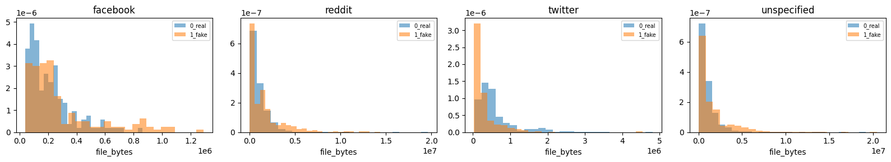
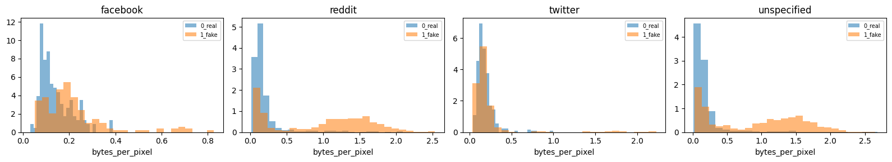
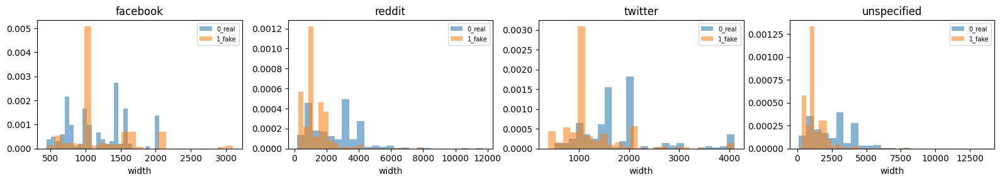
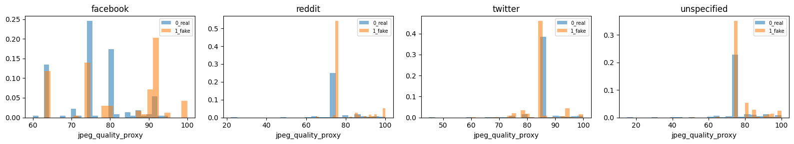

# WildRF: preliminary exploratory data analysis and project suitability

**Project:** Deepfake Detection Web App (academic, non-commercial prototype in India)

**Scope:** WildRF images only; this report does not evaluate video or audio.
**Evidence base:** Saved outputs in [`analysis/WildRF_Preliminary_EDA.ipynb`](analysis/WildRF_Preliminary_EDA.ipynb), inspected on 30 September 2026; authors' paper, project page, repository README, and repository license. The notebook was run in Google Colab by the user. I analyzed its saved outputs; I did not independently rerun the 6.4 GB dataset. The `results.zip` detail files and contact sheets were not present in this repository at report time.

## Executive assessment

WildRF is **useful as an image-only research dataset and a challenging social-platform evaluation source**, but the downloaded archive should **not be treated as a clean, ready-to-use training/test benchmark** for this project. Its strengths are a balanced real/fake class count, three named social platforms in the test folders, readable files, and meaningful variation in image size and encoding. Four findings require action before a credible detector result:

1. **Encoding is strongly associated with the label.** Across the archive, 1,483 of 1,579 PNG images are labeled fake, while JPEG is much more mixed. The Reddit test folders show the same association. A detector can learn file-processing history instead of deepfake evidence.
2. **The supplied split contains exact duplicates across boundaries.** The notebook found 260 exact-copy *pairs* connecting train and test. Pair counts are not counts of unique affected images, but any such connection can inflate an evaluation if left in place.
3. **A face-crop-only pipeline would exclude much of the sampled dataset.** MTCNN found at least one face in 189 of 400 sampled images (47.25%); detection was less frequent for images labeled real. WildRF includes broad AI-generated/manipulated imagery, so it is not exclusively a face-deepfake dataset.
4. **Image-use and consent terms remain unresolved.** The authors' repository license explicitly defines its “Technology” as code, object code, and specifications. It does not clearly grant rights in the social-media images or document consent for their reuse. Keep media and contact sheets private; obtain a clear dataset-use determination before redistribution or deployment.

**Decision:** Candidate for a carefully controlled **image** experiment and robustness tests. Do not use its current train/test scores as evidence of project readiness until deduplication, shortcut controls, rights review, and an untouched cross-platform evaluation are complete. It cannot satisfy the project's video or audio data needs.

## 1. Dataset identity, source, and protocol

This report concerns **WildRF**, introduced by Cavia et al. in *Real-Time Deepfake Detection in the Real-World*, not the unrelated WildFake dataset. The [paper](https://arxiv.org/html/2406.09398v1) and [project page](https://vision.huji.ac.il/ladeda/) describe images collected from Reddit, X/Twitter, and Facebook. The [authors' README](https://github.com/barcavia/RealTime-DeepfakeDetection-in-the-RealWorld#datasets) links the [WildRF Google Drive zip](https://drive.google.com/file/d/1A0xoL44Yg68ixd-FuIJn2VC4vdZ6M2gn/view?usp=sharing) and documents `train/{0_real,1_fake}`, `val/{0_real,1_fake}`, and `test/{reddit,twitter,facebook}/{0_real,1_fake}`. The README says images were manually collected using content-related keywords and hashtags, and describes training on one platform and testing on unseen platforms. The paper describes authentic-photo and AI/manipulation-oriented tags; this is a collection method, **not independent proof of each image's ground-truth authenticity**. [Source: paper §4](https://arxiv.org/html/2406.09398v1), [README](https://github.com/barcavia/RealTime-DeepfakeDetection-in-the-RealWorld#datasets).

The paper's Figure 4 gives 2,150 real and 2,150 fake Reddit images, 340 of each for Twitter, and 160 of each for Facebook: **5,300 images in total**. Its social-protocol text separately describes 1,200 real and 1,200 fake Reddit training images, 750 of each Reddit test images, and the Twitter/Facebook test counts. These are publication claims, not assumptions substituted for the archive inspection. [Source: paper Figure 4 and §5.2](https://arxiv.org/html/2406.09398v1).

## 2. Reproducibility and what was actually measured

The saved notebook output records a successful `gdown` download of a **6,403,695,558-byte** zip. It extracted under `/content/WildRF/WildRF`, found all ten expected leaf folders, and reported no extra file-bearing folders. Pillow decoded every one of the 5,613 files. The notebook saved `metadata.csv`, `summary.json`, duplicate-pair and face-sample CSV files, four metadata figures, and eight contact sheets in `/content/results/`, then created `results.zip`. The zip and underlying media are **not** committed here.

The notebook used seed `20260930`, scanned all readable images for inventory and hashing, trained only small metadata-based diagnostic models, and ran CPU MTCNN on a stratified-by-folder sample of **40 images per split × platform × label** (400 total). It did **not** train or evaluate an image CNN or the project's web-app model. Its `execution_count` fields are empty in the saved file, but cell outputs run through the final package step without a displayed exception. Findings below are based on those saved outputs, not on independent reprocessing of the archive.

For clarity, **observed** means a number printed by this notebook run. **Published** means a claim in the authors' paper. **Inference** means an interpretation requiring additional validation.

## 3. Inventory, folder integrity, and class balance

| Split | Platform recorded by path | Real | Fake | Total | Fake share |
|---|---|---:|---:|---:|---:|
| Train | Unspecified | 1,356 | 1,356 | 2,712 | 50.00% |
| Validation | Unspecified | 199 | 199 | 398 | 50.00% |
| Test | Reddit | 750 | 750 | 1,500 | 50.00% |
| Test | Twitter | 341 | 342 | 683 | 50.07% |
| Test | Facebook | 160 | 160 | 320 | 50.00% |
| **All** | **Mixed/unspecified** | **2,806** | **2,807** | **5,613** | **50.01%** |

**Observed:** No missing expected leaf directories, unreadable files, or unexpected-path files were reported. The archive has **313 more files** than the paper's 5,300-image overview. Its test folders contain 2,503 files. The often-repeated “Reddit 2,150/2,150” claim describes the **whole published Reddit collection**, not `test/reddit`: the observed Reddit test folder correctly has 750/750, matching the paper's test protocol. Observed Twitter test counts exceed the paper by one real and two fake images; Facebook matches. The observed train folders have 1,356/1,356, versus the paper's stated 1,200/1,200 Reddit training set. Validation holds 199/199; the paper's Figure 4 implies approximately 200/200 after subtracting its train and test counts, but does not explicitly define this validation folder. The downloaded zip may represent a revised or differently partitioned release; its version cannot be established from these outputs. [Paper Figure 4 and §5.2](https://arxiv.org/html/2406.09398v1).

**Important provenance limit:** `train` and `val` paths encode a label but **no platform**. The paper calls its training set Reddit, but the notebook cannot verify individual source platforms from these folder names. If one assumes every train/val image is Reddit, the downloaded archive would have 2,305 images per Reddit class, 155 more per class than Figure 4. That calculation is conditional, not observed source attribution. Future manifests should record original platform, source URL or ID where permitted, collection date, and version.

The near-perfect class balance makes a 50% majority-class accuracy baseline appropriate for the listed diagnostics. Balance alone does not remove source, format, content, or manipulation-type bias.

## 4. Image metadata and compression-related shortcuts

This is an image corpus, not a table of measured subject features. The notebook extracted width, height, aspect ratio, file size, bytes per pixel, actual decoded format, extension, EXIF presence, and a JPEG quantization-table quality **proxy**. The proxy fits standard IJG luminance quantization tables and is **not a reliable reconstruction of original JPEG quality** after custom encoding or repeated social-media recompression.

### 4.1 Actual encoding versus labels

| Path platform | Label | JPEG | PNG | WEBP | Total |
|---|---|---:|---:|---:|---:|
| Facebook | Real | 160 | 0 | 0 | 160 |
| Facebook | Fake | 160 | 0 | 0 | 160 |
| Reddit | Real | 722 | 28 | 0 | 750 |
| Reddit | Fake | 270 | 480 | 0 | 750 |
| Twitter | Real | 341 | 0 | 0 | 341 |
| Twitter | Fake | 327 | 15 | 0 | 342 |
| Unspecified train/val | Real | 1,486 | 68 | 1 | 1,555 |
| Unspecified train/val | Fake | 567 | 988 | 0 | 1,555 |
| **All** | **Real** | **2,709** | **96** | **1** | **2,806** |
| **All** | **Fake** | **1,324** | **1,483** | **0** | **2,807** |

The overall archive has **4,033 JPEG**, **1,579 PNG**, and **1 WEBP** image. One `.jpg` extension decoded as WEBP; other listed extensions matched their decoded format. **93.9% of PNGs are labeled fake** (1,483/1,579), compared with **32.8% of JPEGs** (1,324/4,033). Within Reddit test, **480/508 PNGs are fake**, while **270/992 JPEGs are fake**. Within Twitter, the 15 PNGs are all fake, though the sample is small; Facebook is all JPEG, so format alone cannot distinguish its labels. These conditional frequencies are descriptive, not predictive performance estimates. They directly contradict an unqualified assertion that this downloaded WildRF archive “removes JPEG-vs-PNG bias.” It is possible that the authors meant their method or protocol addressed a bias in other benchmarks; the inspected files still show a strong label/format association. The paper specifically criticizes conventional real-JPEG/fake-PNG benchmarks and discusses compression bias. [Paper §4–5](https://arxiv.org/html/2406.09398v1).

### 4.2 Size, dimensions, and JPEG proxy

| Platform | Median real width | Median fake width | Median real bytes/pixel | Median fake bytes/pixel | Median real JPEG proxy | Median fake JPEG proxy |
|---|---:|---:|---:|---:|---:|---:|
| Facebook | 1,116 px | 1,024 px | 0.121 | 0.188 | 74 | 88.5 |
| Reddit | 2,576 px | 1,024 px | 0.124 | 1.105 | 75 | 75 |
| Twitter | 1,536 px | 1,024 px | 0.160 | 0.159 | 85 | 85 |
| Unspecified train/val | 2,448 px | 1,024 px | 0.120 | 1.024 | 75 | 75 |

Real images have a much larger median width than fake images on Reddit, Twitter, and in the unspecified folders. On Reddit and in train/val, fake images also have a much higher median bytes-per-pixel, consistent with their high PNG share. Twitter's near-equal median bytes-per-pixel and all-JPEG Facebook folders show that no *single* metadata cue explains every platform. Facebook's JPEG proxy differs by label, but this proxy is an imprecise descriptor of the stored JPEGs, not proof of stronger or weaker compression at source. EXIF was detected only in **3 Facebook real images**; zero EXIF in other reported groups. EXIF presence is therefore too rare to be a useful standalone explanation, but it remains a possible shortcut in those three files.

These patterns matter for NFR-4 and NFR-17: a model could associate authentic social-media recompression or higher resolution with “real,” causing false alarms when authentic inputs have different processing. **The EDA has not performed controlled compression experiments on a visual detector**, so it cannot quantify that risk yet.

The following four aggregate plots were extracted from the executed notebook's saved outputs. They contain distributions only, not individual dataset images. Histogram heights are density-scaled within each label, so use the tables above for group counts.

## 5. Metadata-only models: strength and interpretation of the shortcut

The notebook fit a logistic regression and a small histogram gradient-boosting classifier using **only metadata** (dimensions, size, format, EXIF, JPEG proxy). It used a stratified random 70/30 split and a second diagnostic trained on `test/reddit` and tested on `test/twitter` plus `test/facebook`. The latter training choice is useful for checking known-platform transfer but **repurposes the authors' Reddit test folder as training data**; it is not the authors' benchmark protocol and must not be reported as model performance on the canonical test set.

| Diagnostic | Model | Train / test images | Accuracy | ROC AUC | Real-image false-positive rate |
|---|---|---:|---:|---:|---:|
| Random 70/30 | Logistic regression | 3,929 / 1,684 | 77.73% | 0.867 | 15.80% (133/842) |
| Random 70/30 | Gradient boosting | 3,929 / 1,684 | 88.90% | 0.960 | 8.08% (68/842) |
| Reddit → Twitter+Facebook | Logistic regression | 1,500 / 1,003 | 54.64% | 0.707 | 9.98% (50/501) |
| Reddit → Twitter+Facebook | Gradient boosting | 1,500 / 1,003 | 76.77% | 0.841 | 7.78% (39/501) |

The majority-class accuracy baseline is 50% in the random split and about 50.05% in the combined cross-platform test. The gradient-boosting result is far above this baseline using **no pixels**, so metadata leakage is a material concern even across named platforms. The logistic model's combined cross-platform AUC of 0.707 with only 54.64% accuracy also shows that ranking performance and the fixed 0.5 classification threshold answer different questions. Do not compare these AUC values with the paper's **average precision** (AP/mAP), which is a different metric. The paper reports LaDeDa mean AP of 93.7% under its own social protocol; that result is not reproduced by this EDA. [Paper Table 5](https://arxiv.org/html/2406.09398v1).

For the gradient-boosting diagnostic separately, Twitter accuracy/AUC were **76.87% / 0.845** and Facebook **76.56% / 0.835**. Real-image false-positive rates were **23/341 (6.74%)** on Twitter and **16/160 (10.0%)** on Facebook. These are false positives from the *metadata diagnostic*, not from the future CNN or web app. The logistic model's corresponding false-positive rates were 24/341 (7.04%) and 26/160 (16.25%).

The random split is further compromised by the duplicate findings below. A sensible next experiment is to compare **format-only, dimensions-only, and full-metadata** baselines after grouping exact/near duplicates before splitting. Then normalize or stratify encoding and resolution across labels and re-evaluate. Merely dropping metadata columns from a CNN input is insufficient: pixel arrays still contain encoding, resizing, and compression signatures.

## 6. Duplicate and leakage audit

All **5,613 readable labeled files** were hashed. Exact duplicates used MD5 byte identity. Near-duplicate candidates used a 64-bit perceptual hash with Hamming distance ≤5, excluding exact-MD5 pairs.

| Relationship | Exact-copy pairs | Near-duplicate candidate pairs |
|---|---:|---:|
| All pairs | 445 | 5 |
| Across split names | 368 | 3 |
| Within the same split name | 77 | 2 |
| Across recorded platform values | 297 | 3 |
| Across labels | 0 | 0 |
| **Train–test connections** | **260** | **3** |

These are **pair counts**: one image appearing in multiple copies can generate several pairs. The notebook output does not give the number of unique duplicate groups or unique affected test images. “Across recorded platform values” includes comparisons to `unspecified` train/val provenance; it does **not** prove that 297 pairs cross two known social networks. Zero cross-label pairs is reassuring for the detected pairs only and does not validate all labels. The five pHash candidates need visual review; the chosen threshold can miss resized, cropped, overlaid, or heavily recompressed copies, while some visually distinct images can collide.

This is a high-priority evaluation issue. Create duplicate-connected groups from the full `duplicate_pairs.csv`, manually review near matches, and keep every group in one split. Publish both pre- and post-cleaning counts. Never tune thresholds on a test set that shares a duplicate group with training. The notebook's random-split metadata scores should be treated as exploratory rather than independent estimates.

## 7. Face applicability and the FR-8 crop requirement

MTCNN ran successfully on **400 sampled images** with **zero detection errors**. The sample used 40 files from each of the ten split/platform/label leaf groups. Train and validation samples are aggregated as platform `unspecified`, giving 80 samples per label there. Images were resized to a maximum side of 800 pixels for detection and boxes were scaled back to original-image coordinates. This is a detector-based sample analysis, **not exhaustive face annotation**.

| Platform in path | Real: ≥1 face | Fake: ≥1 face | Real sample | Fake sample |
|---|---:|---:|---:|---:|
| Facebook | 17 (42.5%) | 26 (65.0%) | 40 | 40 |
| Reddit | 11 (27.5%) | 22 (55.0%) | 40 | 40 |
| Twitter | 22 (55.0%) | 23 (57.5%) | 40 | 40 |
| Unspecified train/val | 23 (28.75%) | 45 (56.25%) | 80 | 80 |
| **All sampled** | **73 (36.5%)** | **116 (58.0%)** | **200** | **200** |

Overall, **189/400 (47.25%)** sampled images had at least one detected face. The asymmetry between real and fake labels is substantial in this sample; whether it reflects semantic-content differences, detection failure, or both is unverified. A face-only inference path could produce a non-random exclusion pattern and would not serve the broader AI-art/manipulated-image content represented here. The appropriate FR-8 design is to detect and crop faces **when present**, report no-face cases, and decide explicitly whether a whole-image branch handles them. Do not silently mark a no-face image as real or exclude it from test denominators.

MTCNN found **308 face boxes** in the sample. Median detected box width and height were **132.2 px** and **173.6 px**. **54/308 boxes** had width or height below 50 px; **33/400 images** had at least one such small box. These quantities have different denominators. A <50×50 threshold is an engineering warning about weak crop detail, not a validated performance cutoff. Review crop quality, multiple-face handling, partial faces, and demographic/content coverage before committing to a face-first architecture. The saved notebook did not measure actual crop-classifier accuracy.

## 8. Implications for the project's stated requirements

| Requirement | Evidence from this EDA | Practical consequence |
|---|---|---|
| **NFR-4: compressed social-media media** | Three named social-platform test folders; mixed encoding and large size differences; JPEG quantization proxy varies. | Useful stress-test source, but run controlled re-encoding of **both** classes at matched JPEG qualities and resolutions. Report platform-stratified performance. The authors' published JPEG-robustness result is for their model, not this project's CNN. |
| **FR-8: face detection and crop** | MTCNN found ≥1 face in 47.25% of a 400-image sample, with different detection rates by label. | Crop when faces exist; retain a documented no-face path and report face-detection coverage and crop failures separately. WildRF is not a face-only benchmark. |
| **NFR-17: minimize false positives on compressed authentic media** | Metadata diagnostic falsely labeled 39/501 real Twitter/Facebook images as fake at its default threshold; encoding and size correlate with labels. | Measure the actual detector's false-positive rate on authentic images by platform, JPEG quality, resolution, and face/no-face status. Choose/calibrate thresholds on validation only. |
| **DR-3: non-commercial use** | Repository Software Research License permits defined technology for research use and excludes commercial gain. | Academic prototype may align with code-license intent, but dataset-image rights are separate and unresolved. Do not infer permission to redistribute images. |
| **DR-6: consent/privacy** | Social-platform images may contain identifiable people; no per-image consent record was found in the examined sources or notebook outputs. | Minimize local copies, restrict access, avoid publishing contact sheets or source URLs, and obtain institutional/legal guidance on dataset handling. |
| **DR-12: no third-party sharing** | The dataset is obtained from a Drive zip; Colab processing and any sharing of `results.zip` are separate handling choices. | Keep images/crops/contact sheets out of Git and public reports. Check whether uploading media to Colab and team distribution comply with project rules before repeating or sharing the analysis. |

The [repository license](https://github.com/barcavia/RealTime-DeepfakeDetection-in-the-RealWorld/blob/main/LICENSE) defines “Research Use” and “Technology” and prohibits commercial use of that technology without a commercial license. It does not clearly state that social-media images in the linked zip inherit that license. The [project page](https://vision.huji.ac.il/ladeda/) has a CC BY-SA footer for the website, which should not be assumed to license the image dataset. This report is a risk identification, not a legal opinion.

## 9. Recommended next analysis and acceptance gates

The following steps turn this EDA into a defensible project dataset decision. They are recommendations; the saved notebook did not execute them.

1. **Resolve dataset rights and provenance.** Record the exact archive URL, download date, archive hash, author/version information, and written terms for research, storage, derivative crops, and redistribution. Ask for clarification where rights or consent are ambiguous. Maintain a restricted-access data register.
2. **Inspect the detailed outputs privately.** Use `duplicate_pairs.csv` to build connected components and review pHash candidate pairs. Inspect the eight contact sheets for obvious content/label patterns, visible people, non-face AI art, watermarks, and sensitive material. No contact sheet was included in this repository, so none of those properties is asserted in this report.
3. **Freeze a leakage-safe manifest.** Preserve the original archive untouched. Create a manifest with relative path, label, split, platform if known, hashes, decoded format, dimensions, and duplicate group. Put each group in only one partition, then recount and report losses by label/platform. Keep original test folders held out; do not train on `test/reddit` for the project's final result.
4. **Audit labels.** Randomly and blindly review examples from each split/platform/label and ambiguous duplicate groups. Record uncertainty, inter-reviewer agreement if multiple reviewers are available, and whether “fake” means face manipulation, fully generated art, or other edits. This matters because the proposed app targets deepfakes rather than all AI imagery.
5. **Control obvious shortcuts.** Compare metadata-only baselines after deduplication. Within each platform, match or stratify JPEG/PNG and resolution across classes where feasible. Use identical decoding and re-encoding pipelines for both labels. Keep an untouched original-encoding evaluation alongside controlled variants so preprocessing does not hide deployment behavior.
6. **Evaluate NFR-4 and NFR-17 directly.** On held-out authentic and fake images, apply the same JPEG qualities, resizing, social-platform-style recompression, and optional format conversion to both classes. Report confusion matrices, real-image false-positive rates, sensitivity, AUROC/AP, and uncertainty intervals by platform, compression level, and face status. Count images as the analysis unit and group duplicates when estimating uncertainty.
7. **Test FR-8 as a pipeline choice.** Compare whole-image, face-crop, and conditional crop-plus-whole-image paths on the same leakage-safe holdout. Track no-face rate, small-face rate, multiple-face handling, crop failure, and processing time. Avoid claiming face coverage from the 400-image sample as a precise corpus-wide rate.
8. **Set a decision gate for the prototype.** Accept WildRF as a supplementary image benchmark only if rights are documented, duplicates are isolated, the held-out test remains untouched, and an actual detector meets the team's predeclared false-positive/robustness targets. Obtain separate datasets for video and audio.

## 10. Limitations and evidence trace

- The notebook outputs were inspected in the user-replaced `.ipynb`; the full `results.zip`, raw media, `metadata.csv`, `duplicate_pairs.csv`, and contact sheets were not available locally. Therefore no unique duplicate-group count, visual label audit, or additional per-file statistics are claimed.
- The face findings are from a fixed 400-image sample and an automated detector. MTCNN negatives are not proof that an image contains no face; the sample's uncertainty and representativeness were not quantified.
- The JPEG quality field is an estimate based on stored quantization tables; it does not identify source platform processing or authentic compression history.
- The two metadata classifiers are diagnostics. Their false positives, accuracies, and AUCs are **not** performance of a pixel-based CNN or of the proposed web app. No video/audio behavior, real-time latency, deployed preprocessing, or privacy controls were tested.
- The paper's counts and results may refer to a different dataset release or filtering protocol. The paper's average precision is not directly comparable to the notebook's ROC AUC. Train/val platform origin is not encoded in paths.
- The notebook's final output says `results.zip` was created, but the archive is not in this repository. The report does not reproduce private dataset images or contact sheets.

### Source and output map

| Statement type | Primary evidence |
|---|---|
| Download, layout, counts, file formats, distributions, model diagnostics, duplicate pairs, face sample, package completion | Saved output cells in [`analysis/WildRF_Preliminary_EDA.ipynb`](analysis/WildRF_Preliminary_EDA.ipynb), sections 2–10; aggregate plots copied to [`figures/`](figures/) |
| Dataset design, collection method, published counts and protocol, published model results | [Cavia et al., *Real-Time Deepfake Detection in the Real-World*](https://arxiv.org/html/2406.09398v1) |
| Linked zip and documented directory structure | [Authors' repository README](https://github.com/barcavia/RealTime-DeepfakeDetection-in-the-RealWorld#datasets) |
| Software-license scope | [Authors' repository LICENSE](https://github.com/barcavia/RealTime-DeepfakeDetection-in-the-RealWorld/blob/main/LICENSE) |
| Project description and website footer | [Authors' project page](https://vision.huji.ac.il/ladeda/) |
